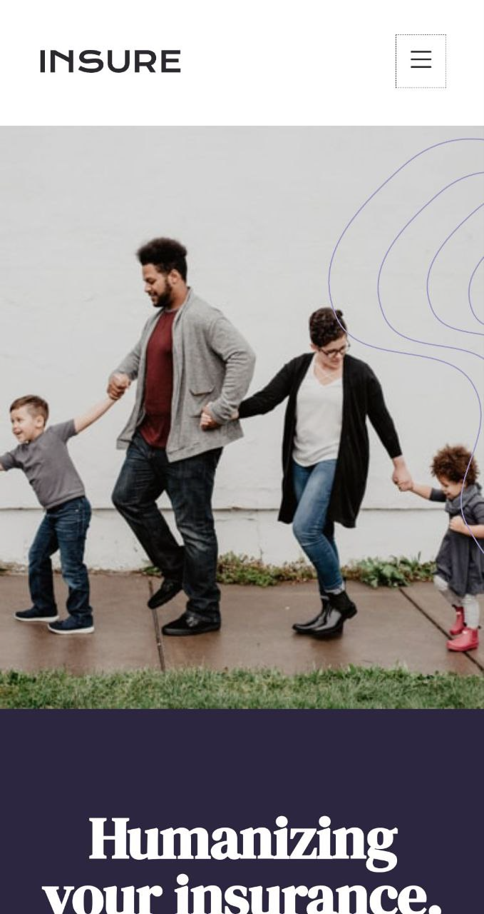

# Insure Landing Page Solution

This is a solution to the **Insure Landing Page** from [Frontend Mentor](https://frontendmentor.io)

- [Insure Landing Page Solution](#insure-landing-page-solution)
  - [Preview](#preview)
    - [Desktop](#desktop)
    - [Mobile: Default](#mobile-default)
    - [Mobile: Navigation expanded](#mobile-navigation-expanded)
  - [Built With](#built-with)
  - [What I learned](#what-i-learned)
  - [Links](#links)

## Preview

### Desktop

### Mobile: Default

### Mobile: Navigation expanded

## Built With

Tech used to build this project.

- HTML
- SCSS
- CSS
- JavaScript
- [Vite](https://vitejs.dev)
- [Bootstrap Icons](https://icons.getbootstrap.com)
- Firefox
- Brave

## What I learned

I got to explore a new world of layouts by building this amazing projects. I was able to use:

- `grid` layout and make it repsonsive.
- use `flex` to create and manage simple and complex layouts
- Build accessible links and buttons
- Match the website to the design as close as possible.

It took about a week because I was busy with my school but I finally completed it on 19/06/2024.

I got to use SCSS to write better and easier CSS. I'm proud of completing it without the help of google or stackoverflow.

## Links

- GitHub Repository: [Visit ➜](https://github.com/Code-Beaker/insure-landing-page-code-beaker-2)
- Vercel Deploy: [Visit ➜](https://insure-landing-page-code-beaker.vercel.app/index.html)
